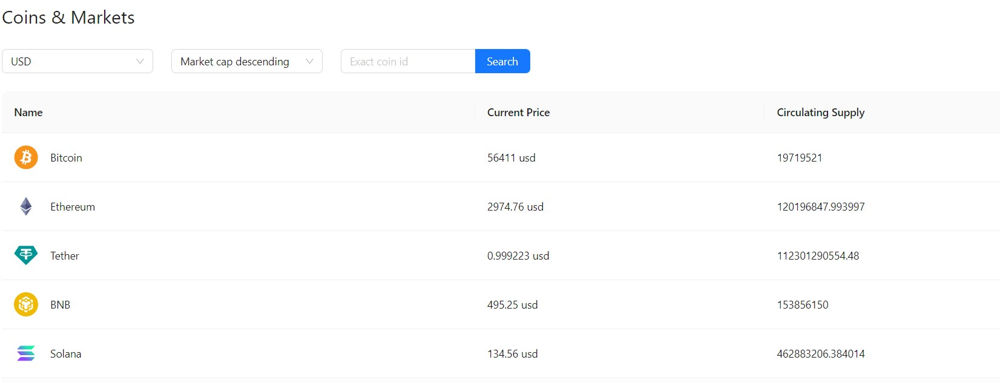

# Crypto currency

This is a React application that displays information about markets crypto currency rate around the world.

## Features

View exchange rates of cryptocurrencies in USD and EUR.

Search for specific cryptocurrencies by id(name).

Sort the data in ascending or descending order.

## Technology stack

React.js, TypeScript, Ant Design
